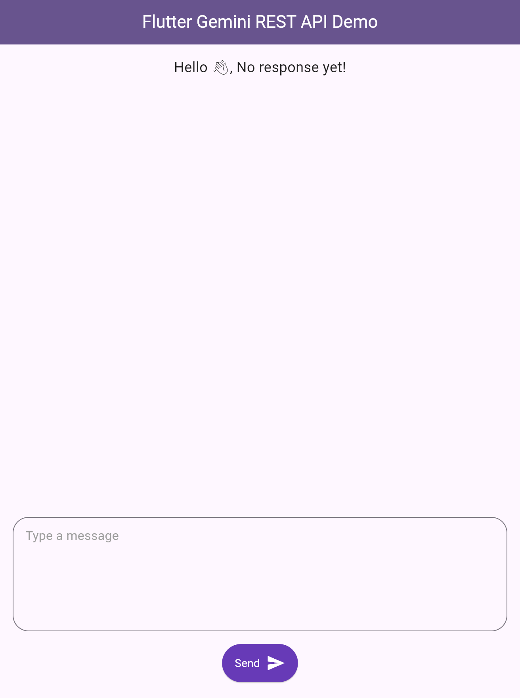
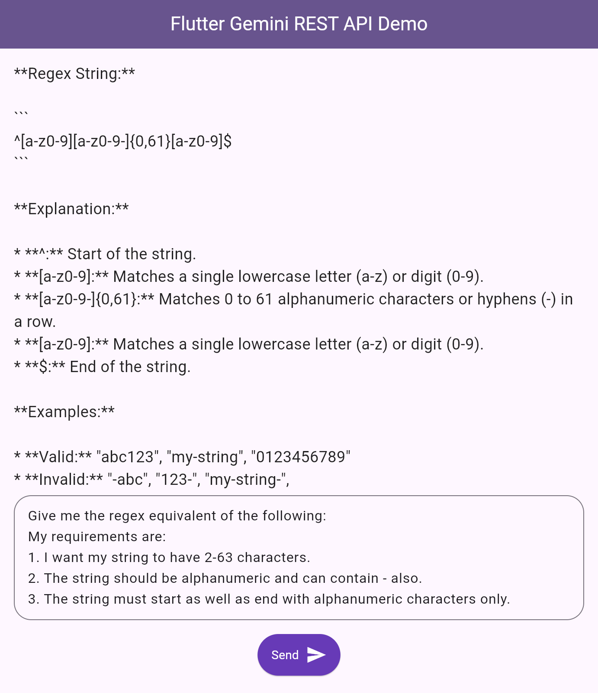

# Flutter Gemini REST API Demo: Unleash the Power of Generative Language Models

This Flutter project serves as a comprehensive demonstration of integrating the Gemini Generative Language Model API into your mobile application. By leveraging the cutting-edge capabilities of Gemini, you can unlock a world of possibilities for natural language processing (NLP) within your Flutter apps.

**Gemini: A Generative Language Powerhouse:**

Gemini, a revolutionary brainchild of Google DeepMind, transcends the boundaries of traditional language models. This multimodal powerhouse seamlessly processes and generates text, images, code, and even audio, paving the way for a new era of rich and interactive user experiences.

**Screenshots:**

**Prerequisites:**

* Flutter SDK: Equip yourself with the latest Flutter development tools. Check out the official documentation for seamless installation: https://docs.flutter.dev/get-started/install(https://flutter.dev/docs/get-started/install)
* Google Cloud Project with Enabled Generative Language API: To harness the power of Gemini, a Google Cloud project with the Generative Language API activated is essential. Follow these steps to get up and running: https://console.cloud.google.com/

**Deployment Guide:**

1. Clone the Repository: Begin by cloning this repository to your local development environment.
2. Forge Your Google Cloud Project: Create a Google Cloud Project and activate the Generative Language API. This grants your project access to the power of Gemini.
3. Unlocking Gemini's Potential: Obtain an API key unique to your project. Replace the placeholder `GEMINI_API_KEY` constant in the `_MyHomePageState` class with your actual key. This grants secure communication with the API.
4. Let the Magic Begin: Execute the application using the `flutter run` command. Witness the magic of Gemini unfold as your app interacts with the API.

**Understanding the Mechanism:**

The application provides a user-friendly interface for interacting with Gemini. You can effortlessly type messages and send them to the model for processing. The `http` package empowers the application to make POST requests to the Gemini API endpoint, transmitting your message for analysis and generation.

Upon receiving the request, Gemini employs its advanced algorithms to process your message. The generated text, brimming with intelligence and creativity, is then sent back as part of the response. Our Flutter app meticulously parses this response, presenting the first candidate's generated content on the screen for your perusal.

**Supporting Cast: Model Files:**

This project leverages a set of well-structured model files to facilitate flawless communication with the Gemini API:

* `Model/contents.dart`: This file defines the `Contents` class, meticulously representing the information sent to Gemini for processing.
* `Model/parts.dart`: The `Parts` class resides within this file, meticulously representing the individual components forming the content sent to Gemini.
* `Model/request.dart`: This file houses the `Request` class, meticulously representing the complete request structure sent to the Gemini API.
* `Model/response.dart`: The `Response` class, meticulously defined within this file, represents the response structure received from the Gemini API.
* Envisioning the Future: A Spark of Inspiration

**While this project provides a solid foundation, a plethora of exciting enhancements awaits exploration:**

* Robust Error Handling: Implementing robust error handling mechanisms safeguards your application against potential API call failures, ensuring a seamless user experience.
* Elevating the User Interface: Craft a chat-like interface for a more engaging and interactive user experience, fostering a natural dialogue flow.
* Visual Storytelling: Integrate UI elements to showcase additional response information retrieved from Gemini, such as confidence scores, for enhanced transparency and deeper insights.
